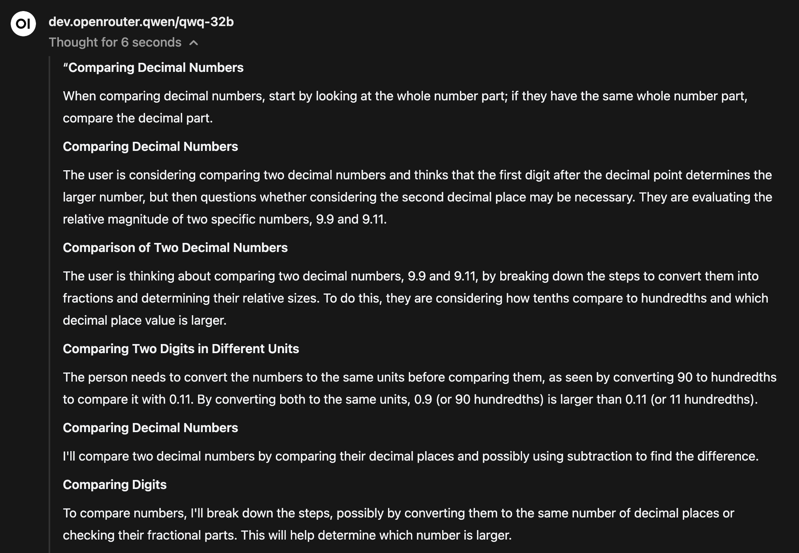

# Open WebUI Reasoning Content Summarizer

This function summarizes the reasoning contents into more readable and structured paragraphs by using a smaller LLM model.

## Setup

1. Import the function.
2. Enable the function.
3. Configure valve:
    - **content_tag**: The content tag of the API response. Defaults to 'content'."
    - **reasoning_tag**: The reasoning tag of the api response. Defaults to 'reasoning' (Openrouter), some provider uses 'reasoning_content'.
    - **api_url**: The API URL for the summarization LLM.
    - **api_token**: The API token for authentication.
    - **model**: The model to be used for summarization.
    - **threshold**: Token count to accumulate before sending to LLM for summarization.
4. Enable the function for your desired model.
    - Navigate to "Models" in Admin tab.
    - Select the model you want to enable this function.
    - Under "filters", check the Reasoning Content Summarizer Function.
5. Alternatively, create a model under "workspace"
    - Navigate to "workspace".
    - Click the "+" button.
    - Enter model name, model id, and select desired a base model.
    - Under "filters", check the Reasoning Content Summarizer Function.

> Note: it is recommended to use a LLM model that is small and has low latency. (I use groq)

## Screenshot 

> Tested on Openrouter's QwQ-32B